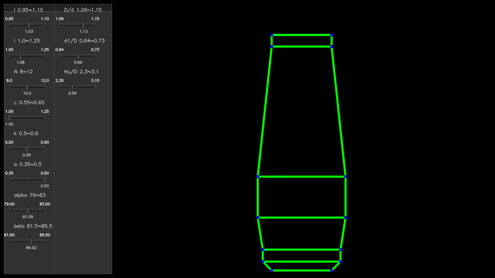

# 高炉炉型模拟软件 Furnace-sim
> 开源软件，仅供学习和交流使用，请勿用于商业用途。
如软件有问题请联系619597329@qq.com
## 使用环境：OpenCV+CMake
## 使用说明：
+ 在config文件夹里改自己要设置的参数
+ 编译命令：
    ```
    mkdir build;
    cd build;
    cmake ..
    make
    ./simulator
    ```
+ 弹出界面后，拖动滑动条可以更改高炉参数，实时看到高炉炉型变化。
按键盘'o'键可以输出详细计算信息。
按'r'键可以导出markdown形式的报告在report文件夹中。
按's'键可以在report文件夹中保存当前炉型图片。
按'ESC'键退出程序。


